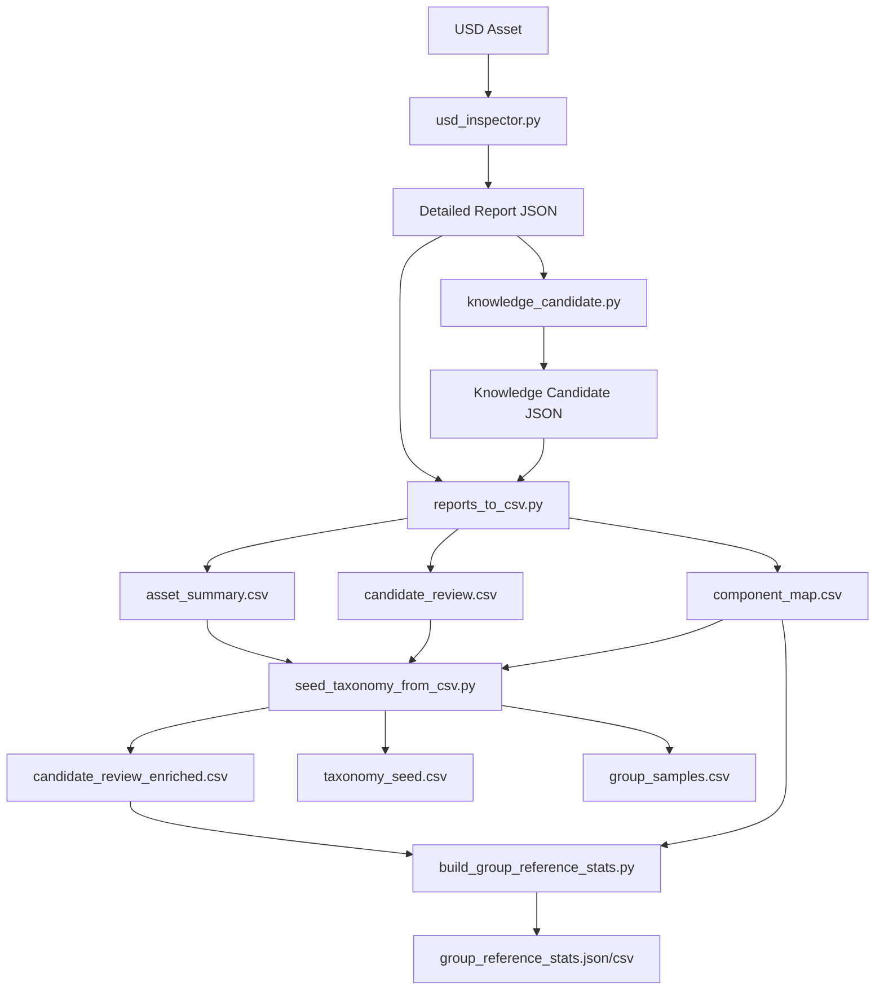
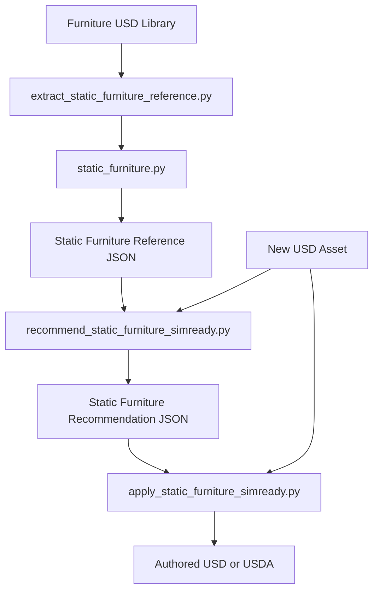
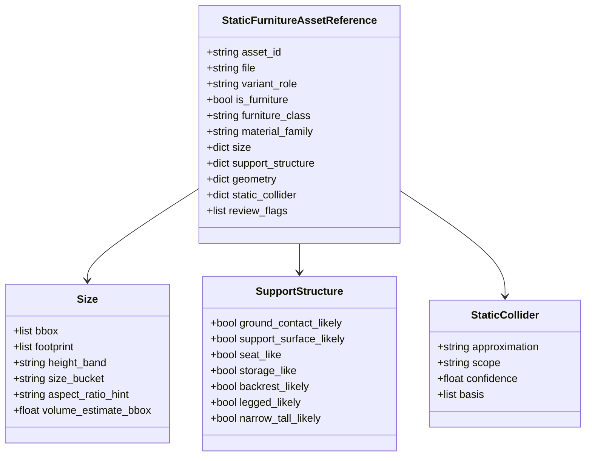
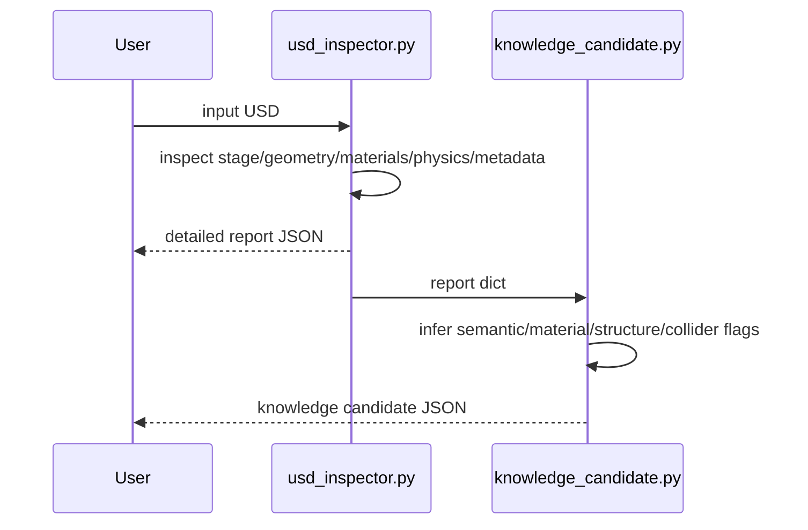
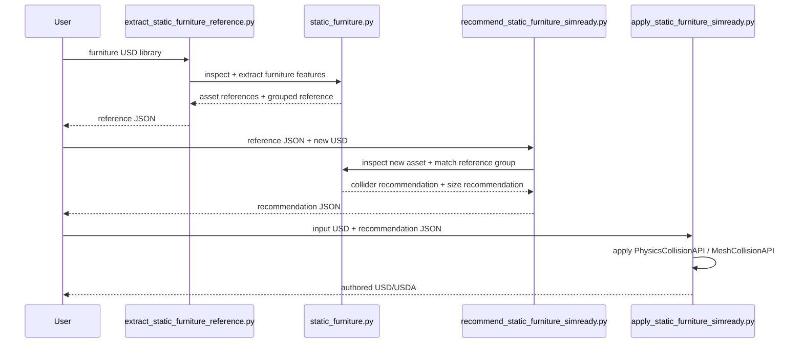

# Architecture And Flow

## Purpose

这份文档用于说明当前项目的代码架构和推荐使用流程，面向后续开发、试用和规则调优。

项目当前包含两条主线：

- 通用 USD 检查与知识候选链路
- 静态家具 SimReady 推荐链路

---

## High-Level Architecture



---

## Static Furniture Architecture



---

## Code Modules

### Core Inspection Layer

- [usd_inspector.py](/mnt/c/Users/songs/Downloads/usd_inspect/usd_inspector.py)
  - 打开 USD Stage
  - 提取基础检查结果
  - 输出 detailed report

内部主要负责：

- `stage`
- `geometry`
- `materials`
- `physics`
- `metadata`
- `issues`
- `notes`

### Knowledge Layer

- [knowledge_candidate.py](/mnt/c/Users/songs/Downloads/usd_inspect/knowledge_candidate.py)
  - 在 report 基础上做规则推断
  - 输出知识候选 JSON

内部主要负责：

- 语义候选
- 材质候选
- 结构模式
- geometry features
- physics values
- collider recommendation
- review flags

### Conversion And Review Layer

- [report_to_knowledge_candidate.py](/mnt/c/Users/songs/Downloads/usd_inspect/report_to_knowledge_candidate.py)
  - 单个 report 转 knowledge candidate

- [reports_to_csv.py](/mnt/c/Users/songs/Downloads/usd_inspect/reports_to_csv.py)
  - 将 JSON 结果扁平化给人工审核

- [seed_taxonomy_from_csv.py](/mnt/c/Users/songs/Downloads/usd_inspect/seed_taxonomy_from_csv.py)
  - 从 CSV 生成 review grouping

- [build_group_reference_stats.py](/mnt/c/Users/songs/Downloads/usd_inspect/build_group_reference_stats.py)
  - 生成 group-level reference stats

### Static Furniture Recommendation Layer

- [static_furniture.py](/mnt/c/Users/songs/Downloads/usd_inspect/static_furniture.py)
  - 当前静态家具链路的共享核心模块

内部主要负责：

- 家具语义分类
- 材质大类抽取
- 尺寸特征抽取
- 支撑结构特征抽取
- 静态 collider 推荐
- reference grouping
- reference matching
- 尺寸建议

- [extract_static_furniture_reference.py](/mnt/c/Users/songs/Downloads/usd_inspect/extract_static_furniture_reference.py)
  - 从一批 USD 提取 reference JSON

- [recommend_static_furniture_simready.py](/mnt/c/Users/songs/Downloads/usd_inspect/recommend_static_furniture_simready.py)
  - 用 `reference JSON + 新 USD` 生成 recommendation JSON

- [apply_static_furniture_simready.py](/mnt/c/Users/songs/Downloads/usd_inspect/apply_static_furniture_simready.py)
  - 根据 recommendation author 静态 collider

---

## Static Furniture Data Model



---

## Runtime Flow

### Flow 1: General Inspection



### Flow 2: Static Furniture Recommendation



---

## Current Usage Flow

### 1. 通用检查链路

```bash
python3 usd_inspector.py asset.usd --pretty --output asset.report.json
python3 report_to_knowledge_candidate.py asset.report.json --output asset.knowledge_candidate.json
python3 reports_to_csv.py --input-dir inspection_reports --output-dir csv_exports --recursive
```

适合：

- 理解资产内容
- 批处理分析
- 人工审核前整理

### 2. 静态家具推荐链路

```bash
python3 extract_static_furniture_reference.py "<assets_dir>" --recursive --output furniture_reference.json
python3 recommend_static_furniture_simready.py furniture_reference.json /path/to/new_asset.usd --output new_asset.recommendation.json
python3 apply_static_furniture_simready.py /path/to/new_asset.usd new_asset.recommendation.json --output new_asset.simready_static.usda
```

适合：

- 家具静态 collider 推荐
- 尺寸参考与缩放建议
- 快速 author 保守的静态碰撞属性

---

## Recommendation JSON Contents

当前 recommendation JSON 主要包含：

- 当前资产抽取的静态家具特征
- `recommended_collider`
- `size_recommendation`
- `reference_group_key`
- `authoring`
- `similar_reference_assets`
- `review_flags`

其中：

- `recommended_collider`
  - 推荐的 collider 类型和 scope

- `size_recommendation`
  - 参考目标 bbox
  - 各轴缩放建议
  - 统一缩放建议
  - 尺寸异常标记

- `authoring`
  - `source_usd_for_authoring`
  - `target_mesh_paths`
  - `approximation`
  - `collision_enabled`

---

## Current Boundaries

当前版本故意保持范围较小。

已覆盖：

- 静态家具分类
- 材质大类
- 尺寸建议
- 静态 collider 推荐
- collider authoring

未覆盖：

- 动态刚体完整流程
- joint / articulation
- vehicle 逻辑
- 摩擦、质量、密度自动推荐
- 自动修改几何尺寸
- 面向非家具资产的专用 reference

---

## Suggested Reading Order

后续开发接手建议按这个顺序看代码：

1. [README.md](/mnt/c/Users/songs/Downloads/usd_inspect/README.md)
2. [PROJECT_PROGRESS_REPORT.md](/mnt/c/Users/songs/Downloads/usd_inspect/PROJECT_PROGRESS_REPORT.md)
3. [static_furniture.py](/mnt/c/Users/songs/Downloads/usd_inspect/static_furniture.py)
4. [recommend_static_furniture_simready.py](/mnt/c/Users/songs/Downloads/usd_inspect/recommend_static_furniture_simready.py)
5. [apply_static_furniture_simready.py](/mnt/c/Users/songs/Downloads/usd_inspect/apply_static_furniture_simready.py)
6. [usd_inspector.py](/mnt/c/Users/songs/Downloads/usd_inspect/usd_inspector.py)
7. [knowledge_candidate.py](/mnt/c/Users/songs/Downloads/usd_inspect/knowledge_candidate.py)
